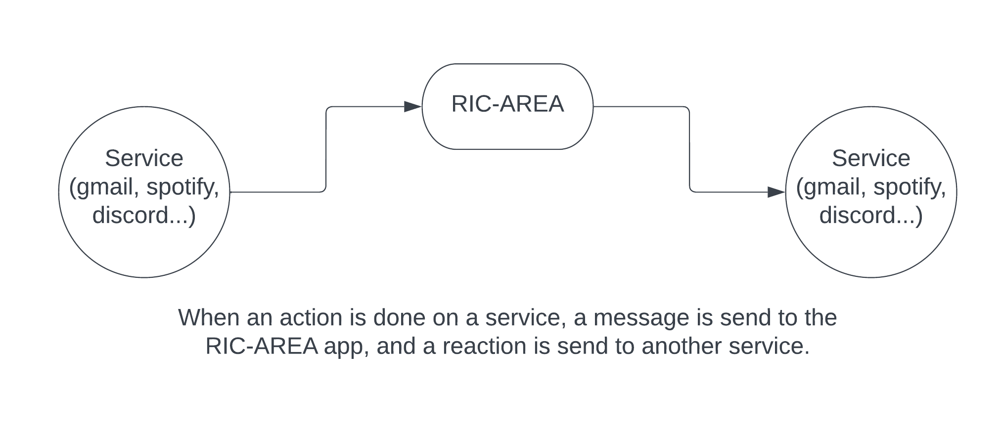
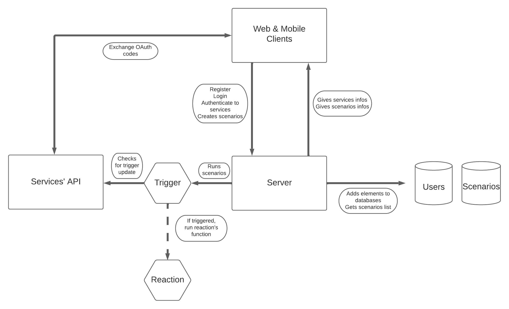
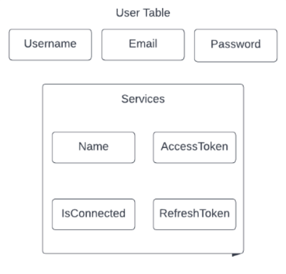
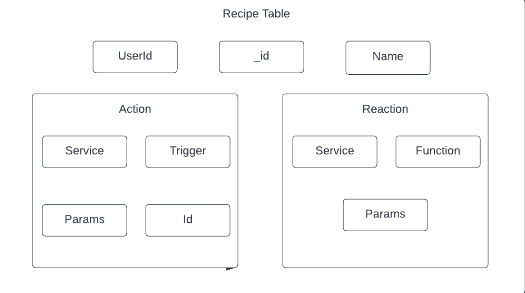

# RIC-AREA

### Summary
1. [What is AREA ?](#What-is-AREA)
2. [Goals](#goals)
3. [How to run](#howto)
4. [Architecture](#architecture)
5. [Data-Base](#DB)
6. [Back-end](#back-end)
    - [API](#api)
7. [Add your own AREAs](#dev)

<a name="What-is-AREA"/>

## What is AREA ?

AREA is a project realized during the 3rd year of epitech.
To do this, you must implement a software suite that functions similar to that of IFTTT and/or Zapier.



<a name="goals"/>

## Goals

The goal of this project is to discover, as a whole, the software platform that you have chosen through the creation of a business application.
This software suite will be broken into three parts :
1. An application server to implement all the features listed below (see Features)
2. A web client to use the application from your browser by querying the application server
3. A mobile client to use the application from your phone by querying the application server

<a name="howto"/>

## How to run

1. Clone repository 
```
git clone git@github.com:EpitechPromo2025/B-DEV-500-MAR-5-2-area-jeremy.calvo.git
```
2. Download prerequisites

```
* Mobile -> React Native
* Web -> ReactJS
* Back-end -> NestJS
* DB -> MongoDB
```
You should also download [Docker](https://docker.com) and [Docker-compose](https://docs.docker.com/compose/)

3. At the root of the repository, run :
```
sudo docker-compose up --build
```
You can build only one of the three parts with the following commands
```
sudo docker-compose up --build mongo
sudo docker-compose up --build server
sudo docker-compose up --build client_web (also gives you mobile APK)
```

### Troubleshooting
If you can't run database, make sure port 27017 isn't used by another process. If so, you should kill the process.

Make sure you're using last Docker version.

<a name="Architecture"/>

## Architecture




<a name="DB"/>

## Data-Base

Some schemes that explain the architecture of the data-base.
We have the first Table: 
#### User Table
Used to manage all of the users.



#### Recipe Table
Used to manage all the data needed to handle the Areaction 


<a name="Back-end"/>

## Back-end

<a name="api"/>

#### API

If you want more details about the root/api, launch the project and go to the following link:
http://localhost:8080/api 


This is all of the services that are provided by our RIC-AREA.

Service:
```
* Spotify
* Github
* Gmail
* Google sheets
* Discord
```

<a name="dev"/>

## Add your own AREAs

One of the strenghts of our project, is that it is really simple to add your own AREAs !

To do so :

#### Add an app

You don't have anything to change client-side, everything is handled by the server. The easiest way to understand how to contribute to the project is to use [this branch](https://github.com/EpitechPromo2025/B-DEV-500-MAR-5-2-area-jeremy.calvo/tree/Developer-template) and to take a look at [TemplateService](https://github.com/EpitechPromo2025/B-DEV-500-MAR-5-2-area-jeremy.calvo/tree/Developer-template/server/src/integrations/template_service).

Implement a new controller and service in src/integrations/

Each app should provide a route 
```
/services/$appname/auth
```
This route will be responsible for OAuth authentication with the service.

Then, go to integrations/integration.service and add your app to processRecipes(), and executeReaction()

That's it ! Now, all you have to do is to add your own triggers and reactions following [TemplateService](https://github.com/EpitechPromo2025/B-DEV-500-MAR-5-2-area-jeremy.calvo/tree/Developer-template/server/src/integrations/template_service) syntax. Make sure your trigger is calling integrationService.executeReaction() when triggered.

### Don't forget to update [integrations.ts JSON](./server/src/constants/integrations.ts) with you addings !
# autopilot
